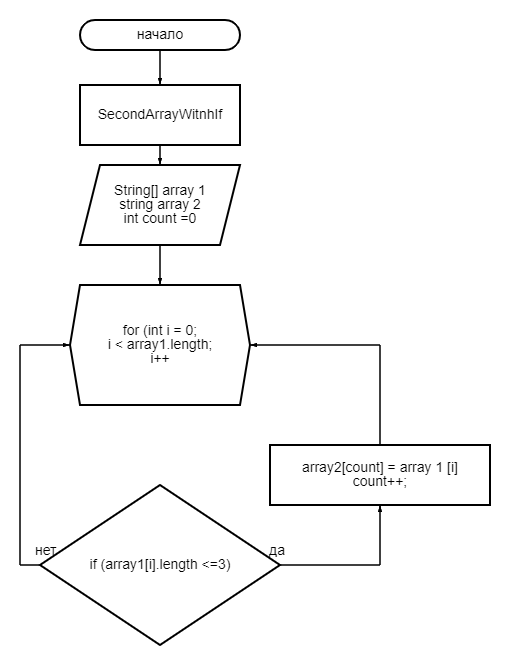

# Финальный тест по курсу "Разработчик"

## Условия задачи

Написать программу, которая из имеющегося массива строк формирует массив из строк, длина которых меньше либо равна 3 символа. Первоначальный массив можно ввести с клавиатуры, либо задать на старте выполнения алгоритма. При решение не рекомендуется пользоваться коллекциями, лучше обойтись исключительно массивами.

## Алгоритм решения

1. Алгоритм выполнения задания:
2. Создать репозиторий на GitHub
3. Нарисовать блок-схему алгоритма
4. Снабдить репозиторий оформленным текстовым описанием решения (файл README.md)
5. Написать программу, решающую поставленную задачу
6. Использовать контроль версий в работе над этим небольшим проектом (не должно быть так, что все залито одним коммитом, как минимум этапы 2, 3 и 4 должны быть расположены в разных коммитах)

## Метод решения
В первую очередь мы возьмем два массива: основной и дополнительный. За основу берем метод, цикл которого соответсвует длине массива с проверкой условия <=3.
Если верно - элемент 1 массива заносится в элемент второго массива с проверкой последовательности заполнения (count). 

## Блок схема решения

